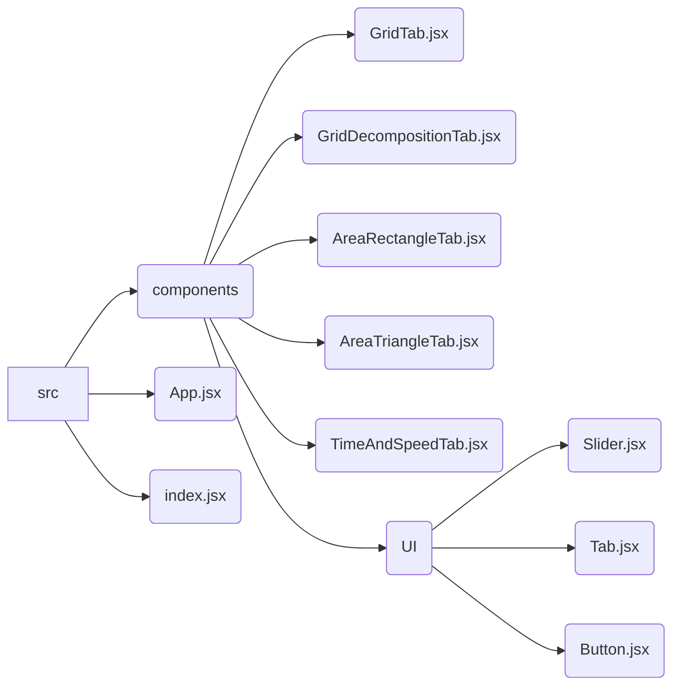

# design.md

## 概要

- **目的**: 掛け算の視覚的アプローチによる多面的理解を促進する。
- **対象ユーザー**: 小学3年生の子供。
- **概要**: 掛け算の概念を多様な方法で視覚的に表現し、楽しく学べる教育Webアプリ。
- **ホスティング**: GitHub Pagesを利用して公開。

## 機能要件

### 1. グリッドタブ

- **目的**: 掛け算を行数と列数で視覚化し、繰り返し加算の概念を伝える。
- **機能**:
  - 2つのスライダーで行数（1〜9）と列数（1〜9）を入力。
  - グリッドはスライダーの操作に応じてリアルタイムに描画され、合計値を自動表示。
- **表示UIの具体例**:
  - スライダーで指定した行数と列数のグリッドが表示される。
  - グリッドの各セルには、そのセルの位置に対応する数字（行番号×列番号）は表示しない（混乱を避けるため）。
  - グリッドの下に、式と合計値（行数×列数）が表示される。
- **データの状態の具体例**:
  - 行数スライダーの値: 3
  - 列数スライダーの値: 4
  - 合計値: 12
  - グリッド表示: 3行4列のグリッドが表示される。

### 2. グリッドの応用（分解）タブ

- **目的**: 掛け算を部分的な計算に分解し、その性質を理解する。
- **機能**:
  - 4つのスライダーで掛け算の数値（1〜100）、縦横分割位置を設定。
  - 分割結果に応じた式を表示（例: (4×4)+(4×4)）。
  - スライダーを細かく調整可能な設計。
- **表示UIの具体例**:
  - スライダーで指定した数値のグリッド(例: 8x8)が表示される
  - 縦横の分割位置を示す線が表示される。(例: 縦4, 横4)
  - 分割された各部分の面積と、全体の面積が表示される
  - 分割結果に応じた式が表示される (例: (4x4) + (4x4) + (4x4) + (4x4) = 64)
- **データの状態の具体例**:
  - 掛け算の数値: 64
  - 縦分割位置: 4
  - 横分割位置: 4
  - 表示される式: (4 x 4) + (4 x 4) + (4 x 4) + (4 x 4) = 64

### 3. 面積（長方形）タブ

- **目的**: 面積を用いて掛け算を視覚化する。
- **機能**:
  - 点線入りの方眼紙の上に色付き長方形を描画。
  - 2つのスライダーで行数と列数（1〜100）を調整。
  - 面積の数値を自動計算して表示。
- **表示UIの具体例**:
  - スライダーで指定した行数と列数の長方形が方眼紙上に表示される。
  - 長方形の面積が数値で表示される。
- **データの状態の具体例**:
  - 行数: 5
  - 列数: 7
  - 面積: 35

### 4. 面積（三角形）タブ

- **目的**: 三角形の面積計算を通じて掛け算の性質を学ぶ。
- **機能**:
  - 点線入りの方眼紙上に三角形を描画。
  - 3つのスライダーで底辺、高さ（1〜100）、および頂点位置（左端、中央、右端）を調整。
  - **正三角形の場合**: 分割や空白部分を色付き点滅で示し、÷2の概念を強調。
  - **直角三角形の場合**: 長方形にしたときの空白部分を色付き点滅で示し、面積が同じであることを視覚的に強調。
- **表示UIの具体例**:
  - スライダーで指定した底辺と高さの三角形が方眼紙上に表示される。
  - 頂点位置のスライダーに応じて、上側の頂点の位置が変化する。
  - 三角形の面積が数値で表示される。
  - 正三角形や直角三角形の場合、分割や空白部分が色付き点滅で強調表示される。
- **データの状態の具体例**:
  - 底辺: 6
  - 高さ: 4
  - 頂点位置: 中央
  - 面積: 12

### 5. 時間と速度タブ

- **目的**: 掛け算を速度と時間の応用として視覚化。
- **機能**:
  - ラジオボタンで時間単位（時間、分、秒）を選択。
  - ラジオボタンで距離単位（キロメートル、メートル）を選択。
  - 速度（1〜100）を入力し、物体の移動アニメーションで距離を視覚化。
  - キャラクターが定規のスケール上を移動し、1秒ごとに進む計算上の距離を弧線と数字で表現。
  - 定規のスケールは速度に合わせて伸縮し、画面上では1秒間に一定のドット数(例: 100ドット)移動する。
  - 「プレイ」ボタンでアニメーションを再生。アニメーション終了後、「リプレイ」ボタンに切り替わる。
- **表示UIの具体例**:
  - キャラクターが定規のスケール上を移動するアニメーションが表示される。
  - 選択した時間単位と入力した速度に応じて、キャラクターの移動する計算上の距離が変化する。
  - 1秒ごとに進む計算上の距離が弧線と数字で表示される。
  - 画面上では、キャラクターは1秒間に一定のドット数(例: 100ドット)移動し、定規のスケールが伸縮する。
  - 「プレイ」ボタンを押すとアニメーションが再生され、アニメーション終了後に「リプレイ」ボタンが表示される。
  - 各数字には単位を明記する。
- **データの状態の具体例**:
  - 時間単位: 秒
  - 距離単位: メートル
  - 速度: 5 メートル/秒
  - 経過時間: 3秒
  - 移動距離: 15メートル

### 共通機能

- 初期値としてデフォルト値を設定。
- 子供向けの直感的で視覚的なUIを設計。
- アニメーションを動的に実行し、結果を自動表示。
- 保存機能は不要。

## 技術スタック

- **プラットフォーム**: Webアプリとして構築し、GitHub Pagesで公開。
- **主要フレームワーク**:
  - React.js: コンポーネントベースのUI管理。
- **技術スタック**:
  - **Vite**: 高速ビルドツールとして使用
  - **HTML5, CSS3, JavaScript**: アプリケーションの基本構築。
  - **React.js**: インタラクティブなUIの構築。
  - **Canvas API**: グラフィックやアニメーション描画。
  - **SVG**: 図形やグラフの描画。
  - **GitHub Pages**: デプロイ環境。
  - **npm**: パッケージ管理。
- **動作環境**: 最新のブラウザ（Chrome, Firefox, Edge）で動作。

## アーキテクチャ設計

- React.jsによるコンポーネントベースのUI設計を採用。
- 状態管理:
  - 各タブの状態は、それぞれ独立したコンポーネント内で`useState`を用いて管理する。
  - タブ間で共有する状態は、`useContext`を用いて管理する。
- Canvas APIとSVGの使い分け:
  - グリッドや面積図など、動的に変化する要素はCanvas APIを使用。
  - 静的な図形やグラフはSVGを使用。
- ディレクトリ構造(例):

## UI設計

- **タブ切り替え**: Webページ上部にタブメニューを配置し、各モードに簡単に切り替え可能。
- **レイアウト**: メイン画面に可視化エリア、下部にスライダーやラジオボタンを配置。
- **レスポンシブ対応**: タブレットを意識したレイアウト。スライダーやボタンをタッチ操作に最適化。縦向きと横向きの両方で操作しやすいように調整。
- **デザインと配色**: 明るい色合いを使用し、各タブにテーマカラーを設定。時間と速度タブではキャラクターを登場させ、親しみやすさを演出。
- **アクセシビリティ**:
  - テキストと背景色が適切なコントラスト比を持つように設計。
  - ボタンやスライダーのタッチ領域を拡大。
  - スクリーンリーダーに対応するため、`aria-label`を適切に付与。

### UI改善 (小学生向け)

- **スライダー**:
  - width: 300px
  - height: 20px
  - つまみ(thumb)の大きさ: 30px x 30px
  - padding: 上下左右に10px追加し、タッチ領域を拡大
  - 左右に矢印ボタンを配置。クリックで値を1ずつ増減。
- **ボタン**:
  - width: 100px
  - height: 40px
  - padding: 上下左右に10px追加し、タッチ領域を拡大

## 開発ツール

- **コードエディタ**:
  - Visual Studio Code (推奨)。
- **品質管理**:
  - ESLint: コード品質チェック。
  - Prettier: コードフォーマット。
- **テストツール**:
  - Playwright: E2Eテストツール。アプリの動作を自動化し、タブの切り替えやインタラクションを検証。
- **デバッグ**:
  - 各開発ステップでテストツールを使ってデバッグ
  - テストツールで確認できない部分はChromeの開発者ツールを利用。

## アクセシビリティ (A11y)

- **コントラスト比**:
  - テキストと背景色が適切なコントラスト比を持つように設計。
- **タッチエリア**:
  - ボタンやスライダーのタッチ領域を拡大し、誤操作を防ぐ。
- **ARIA属性**:
  - スクリーンリーダーに対応するため、`aria-label`を適切に付与。
