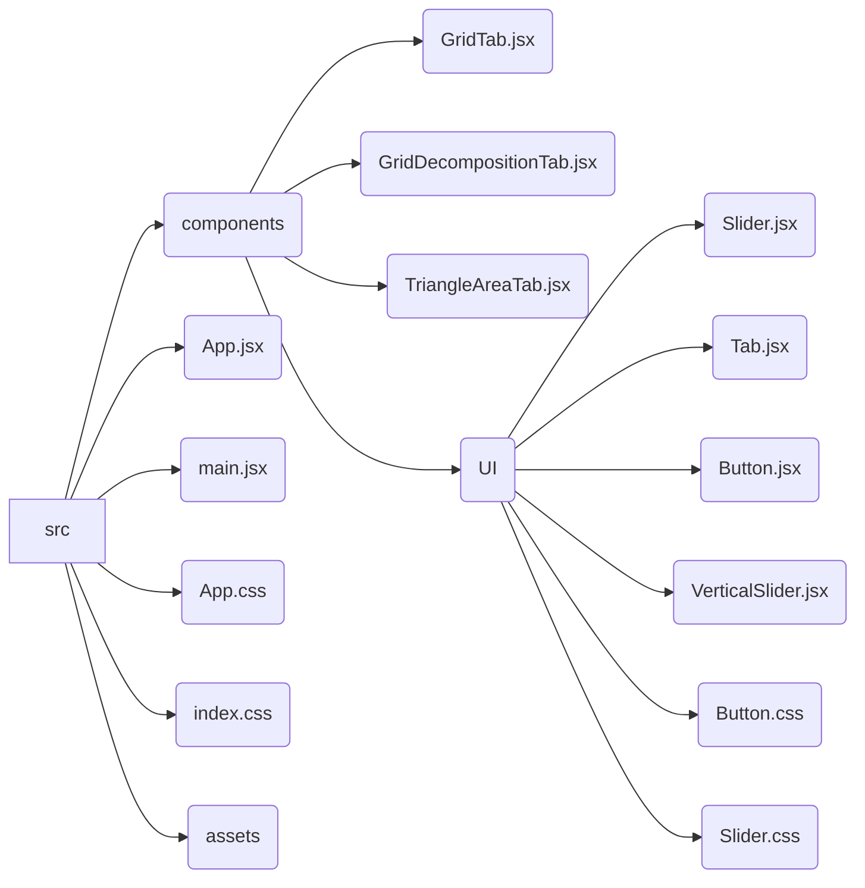

# design.md

## 概要

- **目的**: 掛け算の視覚的アプローチによる多面的理解を促進する。
- **対象ユーザー**: 小学3年生の子供。
- **概要**: 掛け算の概念を多様な方法で視覚的に表現し、楽しく学べる教育Webアプリ。
- **ホスティング**: GitHub Pagesを利用して公開。

## 機能要件

### 1. グリッドタブ

- **目的**: 掛け算を行数と列数で視覚化し、繰り返し加算の概念を伝える。
- **機能**:
  - 2つのスライダーで行数（1〜9）と列数（1〜9）を入力。
  - グリッドはスライダーの操作に応じてリアルタイムに描画され、合計値を自動表示。
- **表示UIの具体例**:
  - 500x500ピクセルの正方形キャンバスにグリッドが描画される。
  - グリッドは常に10行10列すべて表示され、実際の値（スライダーで設定した行×列）のセルが色付けされる。
  - 列数スライダーと行数スライダーがグリッド表示エリアの下に配置される。
  - 式と結果（例: 「式: 3 × 4 = 12」）が大きな青色のボタンにわかりやすく表示される。
  - スクロールなしで全体が見えるよう要素間の余白が最適化されている。
  - 5の位置にオレンジ色の目立つラインが表示され、数字の規則性を視覚的に理解しやすくする。
- **データの状態の具体例**:
  - 行数スライダーの値: 3
  - 列数スライダーの値: 4
  - 合計値: 12
  - グリッド表示: 3行4列のグリッドが表示される。

### 2. グリッドの応用（分解）タブ

- **目的**: 掛け算を部分的な計算に分解し、その性質を理解する。
- **機能**:
  - グリッドタブの機能・デザイン・配置をベースにする。
  - 画面下部に配置した2つのスライダーで行数（1〜10）と列数（1〜10）を入力。
  - グリッド表示の上面と右側面に配置された2つのスライダーで縦横分割位置を設定(1〜10)。
  - スライダーの値に応じた式と結果(例：8×8 = 64)と、その下に分割結果に応じた式を表示（縦横を4で分割した例:(4×4) + (4×4) + (4×4) + (4×4) = 64）。
  - スライダーを細かく調整可能な設計。
- **表示UIの具体例**:
  - 500x500ピクセルの正方形キャンバスにグリッドが描画される。
  - グリッドは常に10行10列すべて表示され、実際の値（スライダーで設定した行×列）のセルが色付けされる。分割された領域ごとに色弱者にも識別しやすい色（青、茶、紫、赤）で色分けされる。
  - 列数スライダーと行数スライダーがグリッド表示エリアの下に配置される。
  - スライダーの値に応じた式と結果（例: 「式: 8 × 8 = 64」）が大きな青色のボタンにわかりやすく表示される。式の表示位置はグリッド表示エリアの下に配置される。
  - 縦分割スライダーと横分割スライダーがグリッド表示エリアの上と右に配置される。スライダーの長さはグリッドの最外周の辺の長さに合わせ、スライダーの位置もグリッド最外周の位置に合わせる。横分割スライダーは下側が0になるように設定する。
  - 縦横の分割位置を示す黒色の太い点線が分割スライダーの位置に表示される。(例: 縦4, 横4)
  - 分割結果に応じた式と結果（例: 4×4 + 4×4 + 4×4 + 4×4 = 64）がスライダーの値に応じた式の下にわかりやすく表示される。分割線がグリッドの実際の大きさを超える場合、実際のグリッドサイズに基づいた式が表示される。例えば、8×8で縦分大4、横分大9の場合は(4×8) + (4×8) = 64と表示される。
- **データの状態の具体例**:
  - 掛け算の数値: 8×8
  - 縦分割位置: 4
  - 横分割位置: 4
  - 表示される式: (4×4) + (4×4) + (4×4) + (4×4) = 64。分割線がグリッドの実際の大きさを超える場合は、実際のグリッドサイズに基づいた式が表示される。

### 3. 面積（三角形）タブ

- **目的**: 三角形の面積計算を通じて掛け算の性質を学ぶ。
- **機能**:
  - グリッドタブの機能・デザイン・配置をベースにする。
  - グリッド上に三角形(頂点は上、左下、右下)を描画。
  - 2つのスライダーで底辺、高さ（1〜10）を調整。
  - ラジオボタンで上側の頂点位置（左端、中央、右端）を調整。
  - 三角形の左下の頂点はグリッドエリアの左下に固定される。
  - **正三角形(頂点位置中央)の場合**: 底辺と高さを長方形にしたときの空白部分を色付き点滅で示し、÷2の概念を強調。
  - **直角三角形(頂点位置左端・右端)の場合**: 底辺と高さを長方形にしたときの空白部分を色付き点滅で示し、面積が同じであることを視覚的に強調。
- **表示UIの具体例**:
  - スライダーで指定した底辺と高さの三角形がグリッド上に表示される。
  - グリッドエリアとタブ選択ボタンの間に配置した、頂点位置調整用のラジオボタンに応じて、上側の頂点の位置が変化する。
  - 三角形の面積が数値で表示される((底辺×高さ)÷2)。
  - 正三角形や直角三角形の場合、底辺と高さで作る長方形の空白部分が色付き点滅で強調表示される。
- **データの状態の具体例**:
  - 底辺: 6
  - 高さ: 4
  - 頂点位置: 中央
  - 面積: 12

### 共通機能

- 初期値としてデフォルト値を設定。
- 子供向けの直感的で視覚的なUIを設計。
- アニメーションを動的に実行し、結果を自動表示。
- 保存機能は不要。
- 各タブのデザインやレイアウトは1つのアプリとして違和感が無いように一貫性をもたせる

## 技術スタック

- **プラットフォーム**: Webアプリとして構築し、GitHub Pagesで公開。
- **主要フレームワーク**:
  - React.js: コンポーネントベースのUI管理。
- **技術スタック**:
  - **Vite**: 高速ビルドツールとして使用
  - **HTML5, CSS3, JavaScript**: アプリケーションの基本構築。
  - **React.js**: インタラクティブなUIの構築。
  - **Canvas API**: グラフィックやアニメーション描画。
  - **SVG**: 図形やグラフの描画。
  - **GitHub Pages**: デプロイ環境。
  - **npm**: パッケージ管理。
- **動作環境**: 最新のブラウザ（Chrome, Firefox, Edge）で動作。

## アーキテクチャ設計

- React.jsによるコンポーネントベースのUI設計を採用。
- 状態管理:
  - 各タブの状態は、それぞれ独立したコンポーネント内で`useState`を用いて管理する。
  - タブ間で共有する状態は、`useContext`を用いて管理する。
- Canvas APIとSVGの使い分け:
  - グリッドや面積図など、動的に変化する要素はCanvas APIを使用。
  - 静的な図形やグラフはSVGを使用。
- ディレクトリ構造:

- 各ファイルの役割:
  - `App.jsx`: アプリケーションのメインコンポーネント。タブ切り替えを管理。
  - `main.jsx`: アプリケーションのエントリーポイント。ReactアプリをDOMにマウント。
  - `GridTab.jsx`: グリッドタブのコンポーネント。行と列のスライダー、グリッド描画を管理。
  - `GridDecompositionTab.jsx`: グリッド分解タブのコンポーネント。行、列、縦分割、横分割のスライダーとグリッド描画を管理。
  - `TriangleAreaTab.jsx`: 面積（三角形）タブのコンポーネント。底辺と高さのスライダー、頂点位置のラジオボタン、三角形描画と面積計算を管理。
  - `UI/Tab.jsx`: タブ切り替え用のコンポーネント。
  - `UI/Button.jsx`: ボタンコンポーネント。
  - `UI/Slider.jsx`: 水平方向のスライダーコンポーネント。
  - `UI/VerticalSlider.jsx`: 縦方向のスライダーコンポーネント。
  - `UI/Button.css`: ボタンのスタイル。
  - `UI/Slider.css`: スライダーのスタイル。水平・縦方向のスライダーのスタイルを定義。

## UI設計

- **タブ切り替え**: Webページ上部にタブメニューを配置し、各モードに簡単に切り替え可能。
- **レイアウト**:
  - アプリケーション全体のコンテナが画面中央に寄らないように、幅を広げて画面全体を活用するレイアウトにする (例: `max-width` の調整や解除)。
  - 各タブのメインコンテンツ（可視化エリア）を大きく表示し、操作要素（スライダー、ボタンなど）は下部や左右に分かりやすく配置する。
- **レスポンシブ対応**:
  - タブレットを意識したレイアウト。スライダーやボタンをタッチ操作に最適化。縦向きと横向きの両方で操作しやすいように調整。
  - 全体的に文字サイズを拡大し、特にラベルや結果表示を見やすくする。画面サイズに応じてフォントサイズが調整されるように、`rem` 単位や `vw/vh` 単位、メディアクエリなどを適切に利用する。
- **デザインと配色**: 明るい色合いを使用し、各タブにテーマカラーを設定。子供が親しみやすいデザインを重視。
- **アクセシビリティ**:
  - テキストと背景色が適切なコントラスト比を持つように設計。
  - ボタンやスライダーのタッチ領域を拡大。
  - スクリーンリーダーに対応するため、`aria-label`を適切に付与。

### UI改善 (小学生向け)

- **スライダー**:
  - width: 300px
  - height: 20px
  - つまみ(thumb)の大きさ: 30px x 30px
  - padding: 上下左右に10px追加し、タッチ領域を拡大
  - 左右に矢印ボタンを配置。クリックで値を1ずつ増減。
- **ボタン**:
  - width: 100px
  - height: 40px
  - padding: 上下左右に10px追加し、タッチ領域を拡大

## 開発ツール

- **コードエディタ**:
  - Visual Studio Code (推奨)。
- **品質管理**:
  - ESLint: コード品質チェック。
  - Prettier: コードフォーマット。
- **テストツール**:
  - Playwright: E2Eテストツール。アプリの動作を自動化し、タブの切り替えやインタラクションを検証。
- **デバッグ**:
  - 各開発ステップでテストツールを使ってデバッグ
  - テストツールで確認できない部分はChromeの開発者ツールを利用。

## アクセシビリティ (A11y)

- **コントラスト比**:
  - テキストと背景色が適切なコントラスト比を持つように設計。
- **タッチエリア**:
  - ボタンやスライダーのタッチ領域を拡大し、誤操作を防ぐ。
- **ARIA属性**:
  - スクリーンリーダーに対応するため、`aria-label`を適切に付与。
